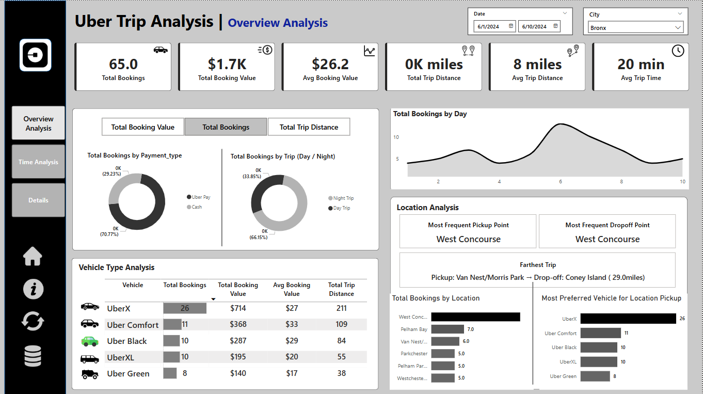
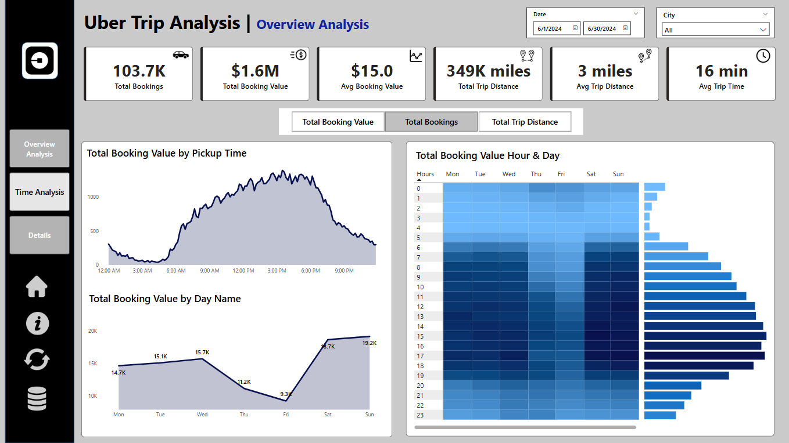
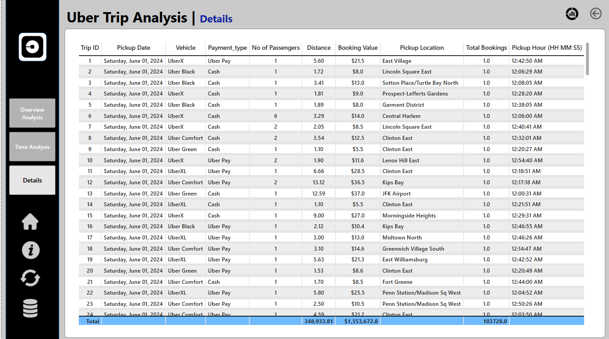

# 🚗 Uber Trip Analysis Dashboard with Power BI

This repository contains a Power BI dashboard project focused on analyzing Uber trip data to uncover insights into ride patterns, booking behavior, and operational efficiency.

## Content

**Datasets**
 - Trip Details - https://github.com/sobiakarim/Uber-Trip-Analysis-using-Power-BI/blob/main/Uber%20Trip%20Details.xlsx
 - Location Details - https://github.com/sobiakarim/Uber-Trip-Analysis-using-Power-BI/blob/main/Location%20Table.xlsx

**Dashboard**
-  Power BI dashboard file - https://github.com/sobiakarim/Uber-Trip-Analysis-using-Power-BI/blob/main/uber.pbix

## 📌 Project Overview

The **Uber Trip Analysis** project was built using Power BI to help stakeholders explore and visualize trip data in an interactive and insightful manner. The analysis focuses on key performance indicators such as total bookings, revenue, trip duration, and location-based trends.

## 🛠️ Tools & Technologies
- Power BI
- DAX (Data Analysis Expressions)
- Bookmarks
- Drill-through
- Slicers & Tooltips
- Interactive Visualizations

## 📊 Dashboards Included

### 1. Overview Analysis Dashboard
This dashboard offers a high-level summary of Uber trip data:
- **KPIs**: 
  - Total Bookings
  - Total Booking Value
  - Average Booking Value
  - Total Trip Distance
  - Average Trip Distance
  - Average Trip Time
- **Visualizations**:
  - Dynamic Measure Selector
  - Bookings by Payment Type (Cash, Uber Pay)
  - Bookings by Trip Type (Day/Night)
  - Booking Trends by Day
  - Most Frequent Pickup & Drop-off Points
  - Farthest Trip Details
  - Vehicle Type Analysis (UberX, Comfort, Black, XL, Green)
  - Top 5 Locations by Bookings
- **Interactive Features**:
  - City and Date Slicers
  - Dynamic Titles
  - Tooltips for deeper insights
  - Conditional Formatting

### 2. Time Analysis Dashboard
Designed to understand trip demand by time:
- **Visualizations**:
  - Area Chart by 10-Minute Pickup Intervals
  - Line Chart by Day of the Week
  - Heatmap (Hour vs Day) for peak hours
- **Dynamic Measure Selector** for:
  - Total Bookings
  - Total Booking Value
  - Total Trip Distance

### 3. Trip Details Dashboard
Tabular view for granular-level data:
- **Features**:
  - Interactive Grid/Table for trip-level details
  - Drill-through from other visuals
  - Bookmark for toggling full dataset vs filtered view

## 📦 Features
- Dynamic measure selection using disconnected tables
- Drill-through functionality for data exploration
- Clear slicer button for quick reset
- Export raw data (Power Automate support)
- Data-driven design with conditional formatting

## 📈 Business Outcomes
- Identification of booking trends and revenue drivers
- Analysis of trip efficiency and distance patterns
- Insights into location-wise demand and vehicle preferences
- Support for pricing and driver allocation strategies

## 📁 Overview

